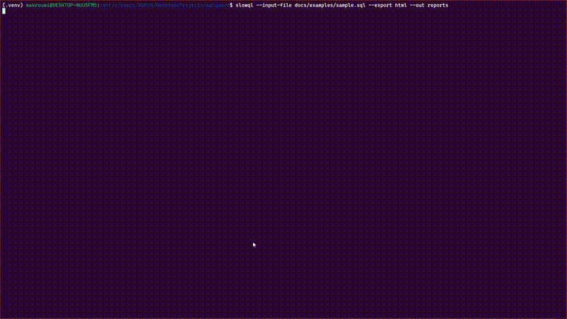

# SlowQL

**Catch expensive SQL before it hits production.**  
Static, offline SQL analyzer that prevents performance regressions, security risks, correctness bugs, and cloud‑cost traps — with a polished terminal experience.

[](https://github.com/makroumi/slowql/releases) [](https://pypi.org/project/slowql/) [](https://hub.docker.com/r/makroumi/slowql) [](https://github.com/makroumi/slowql/pkgs/container/slowql) [](https://hub.docker.com/r/makroumi/slowql) [](https://pypistats.org/packages/slowql) [](https://github.com/makroumi/slowql/stargazers) [](https://github.com/makroumi/slowql/actions) [](https://codecov.io/gh/makroumi/slowql) [](https://github.com/charliermarsh/ruff) [](http://mypy-lang.org/) [](https://docs.pytest.org/) [](https://github.com/makroumi/slowql/security/dependabot) [](https://snyk.io/test/github/makroumi/slowql) [](https://github.com/makroumi/slowql/discussions) [](https://github.com/makroumi/slowql/graphs/contributors) [](https://github.com/sponsors/makroumi)



## 🚀 Quick Start Checklist

**New to SlowQL? Follow these steps:**

- [ ] **Install SlowQL** (see [Installation](#installation))
- [ ] **Try the demo** with sample queries
- [ ] **Analyze your SQL files** using the CLI
- [ ] **Set up CI/CD integration** for automated checks
- [ ] **Explore advanced features** (exports, interactive mode)

## Table of Contents

- [What is SlowQL?](#what-is-slowql)
- [Why Teams Choose SlowQL](#why-teams-choose-slowql)
- [Installation](#installation)
- [Getting Started](#getting-started)
- [Key Features](#key-features)
- [Interactive Terminal Experience](#interactive-terminal-experience)
- [CLI Reference](#cli-reference)
- [Export Formats](#export-formats)
- [Detection Rules](#detection-rules)
- [How It Works](#how-it-works)
- [CI/CD Integration](#cicd-integration)
- [Container Deployment](#container-deployment)
- [Performance & Privacy](#performance--privacy)
- [Development & Contributing](#development--contributing)
- [FAQ](#faq)
- [Roadmap](#roadmap)

## What is SlowQL?

SlowQL is a **static SQL analyzer** that catches performance, security, and correctness issues in your SQL queries before they reach production. Think of it as a spell-checker for SQL, but much more powerful.

### Core Capabilities
- 🔍 **Static Analysis**: No database connections required
- 🎯 **Multi-Dimensional Detection**: Security, Performance, Cost, Reliability, Compliance, Quality
- 🖥️ **Premium Terminal UI**: Modern, animated interface with keyboard navigation
- 📊 **Multiple Export Formats**: JSON, HTML, CSV for reports and automation
- 🔧 **CI/CD Ready**: Non-interactive mode for automated pipelines
- 🔒 **Privacy-First**: Your SQL never leaves your machine

### Supported SQL Dialects
- PostgreSQL, MySQL, SQLite, SQL Server
- Snowflake, BigQuery, Redshift
- Pattern coverage varies by rule

## Why Teams Choose SlowQL

### For Developers & Data Engineers
- **Prevent Costly Mistakes**: Catch `SELECT *`, missing WHERE clauses, and performance killers
- **Learn Best Practices**: Get actionable recommendations with real fixes
- **Speed Up Reviews**: Automated checks reduce manual code review time
- **Safe Exploration**: Test queries risk-free without touching production data

### For DevOps & Platform Teams
- **Reduce Cloud Costs**: Prevent full-table scans and expensive operations
- **Security Compliance**: Detect SQL injection risks and hardcoded secrets
- **Automated Quality Gates**: Integrate into CI/CD pipelines
- **Comprehensive Reporting**: Generate shareable reports for leadership

### For Security Teams
- **Attack Prevention**: Detect SQL injection vectors and dynamic SQL risks
- **Compliance Monitoring**: Identify PII exposure and audit violations
- **Risk Assessment**: Quantify and prioritize security issues
- **Documentation**: Maintain security audit trails

## Installation

### Prerequisites
- Python 3.11+ (3.12+ recommended)
- pip or pipx package manager

### Method 1: Recommended (pipx)
```bash
# Install with pipx (isolated environment)
pipx install slowql

# Optional: Install readchar for interactive menus
pipx install readchar
```

### Method 2: Standard (pip)
```bash
# Install in current Python environment
pip install slowql

# Optional: Install readchar for interactive menus
pip install readchar
```

### Method 3: Development Version
```bash
# Clone and install from source
git clone https://github.com/makroumi/slowql.git
cd slowql
pip install -e ".[dev]"
```

### Verification
```bash
# Check installation
slowql --version

# View help
slowql --help
```

### Troubleshooting Installation

**Python Version Issues:**
```bash
# Check Python version
python --version  # Should be 3.11+

# If using pyenv
pyenv install 3.12.0
pyenv global 3.12.0
```

**Permission Issues:**
```bash
# Use user installation
pip install --user slowql

# Or use pipx (recommended)
pipx install slowql
```

## Getting Started

### 1. Quick Analysis Demo

Create a test file and analyze it:
```bash
# Create sample SQL file
cat > sample.sql << 'EOF'
SELECT * FROM users WHERE email LIKE '%@gmail.com';
UPDATE users SET password = 'secret123' WHERE id = 1;
SELECT name, email FROM users;
EOF

# Analyze the file
slowql --input-file sample.sql
```

### 2. Interactive Mode

Start the interactive terminal interface:
```bash
slowql --mode auto
```

Then use arrow keys to navigate:
- **↑/↓** to move between options
- **Enter** to select
- **q/Esc** to cancel

### 3. Compare Queries

Analyze and compare two versions of a query:
```bash
slowql --compare
```

### 4. Export Results

Generate reports in multiple formats:
```bash
slowql --input-file sample.sql --export html csv json
```

### 5. CI/CD Integration

For automated pipelines:
```bash
slowql --non-interactive --input-file sql/ --export json
```

## Key Features

### Comprehensive Rule Detection

#### 🔒 Security Rules
- **SQL Injection Detection**: String concatenation patterns
- **Hardcoded Credentials**: Passwords, API keys, tokens
- **Excessive Privileges**: GRANT ALL and wildcard permissions
- **PII Exposure**: Email, SSN, credit card patterns

#### ⚡ Performance Rules
- **SELECT ***: Wildcard selection issues
- **Non-SARGable Queries**: Functions on columns, leading wildcards
- **Deep Pagination**: Large OFFSET operations
- **Heavy Operations**: JSON extraction, regex in WHERE

#### 💰 Cost Optimization
- **Unbounded Scans**: Large table operations without limits
- **Cross-Region Joins**: Expensive data transfers
- **Resource-Heavy Operations**: Sorting, hashing overhead

#### 🛡️ Reliability Rules
- **Data Loss Prevention**: UPDATE/DELETE without WHERE
- **Schema Safety**: DROP TABLE detection
- **Transaction Safety**: BEGIN/COMMIT patterns

#### 📋 Quality Rules
- **Modern SQL**: Explicit JOIN syntax, CTEs
- **Code Maintainability**: Consistent naming, style
- **Best Practices**: Query structure optimization

### Premium Terminal Experience

#### Dashboard Features
- **Health Score**: 0-100 score with visual gauge
- **Severity Heat Map**: Issue distribution by type
- **Interactive Tables**: Sortable, filterable results
- **Real-time Analysis**: Live progress indicators

#### Animation System
- **Matrix Rain**: Intro animation
- **Glitch Transitions**: Smooth state changes
- **Loading Animations**: Visual feedback during analysis

## Interactive Terminal Experience

### Navigation Modes

#### 1. Input Mode Selection
- **Compose**: Interactive SQL editor with syntax highlighting
- **Paste**: Direct SQL input from clipboard
- **File**: Browse and select SQL files
- **Compare**: Side-by-side query comparison

#### 2. Quick Actions Menu
- **Export Report**: Generate HTML/CSV/JSON reports
- **Analyze More**: Continue with additional queries
- **Exit**: Leave the application

#### 3. Export Format Selection
- **JSON**: Machine-readable results
- **HTML**: Shareable web reports
- **CSV**: Spreadsheet-compatible data
- **All**: Generate all formats

### Keyboard Shortcuts

| Action | Key(s) | Description |
|--------|--------|-------------|
| Navigate | ↑/↓ | Move between menu items |
| Select | Enter | Confirm selection |
| Cancel | q/Esc | Exit current menu |
| Quick Actions | A/E/X | Export/Analyze/Exit shortcuts |

### Terminal Fallbacks
If `readchar` isn't available or terminal isn't interactive:
- Numeric menu prompts (1, 2, 3...)
- Standard input/output
- Non-interactive mode for automation

## CLI Reference

### Usage
```bash
slowql [OPTIONS] [FILE]
```

### Input Options
| Option | Description | Example |
|--------|-------------|---------|
| `FILE` | SQL file to analyze | `slowql queries.sql` |
| `--input-file PATH` | Input file path | `slowql --input-file queries.sql` |
| `--mode MODE` | Input mode: auto, paste, compose | `slowql --mode compose` |

### Analysis Options
| Option | Description | Example |
|--------|-------------|---------|
| `--no-cache` | Disable result caching | `slowql --no-cache` |
| `--compare` | Enable comparison mode | `slowql --compare` |

### Output Options
| Option | Description | Example |
|--------|-------------|---------|
| `--export FORMAT` | Auto-export formats | `slowql --export html csv json` |
| `--out PATH` | Output directory | `slowql --out ./reports` |
| `--verbose` | Detailed analyzer output | `slowql --verbose` |

### UI Options
| Option | Description | Example |
|--------|-------------|---------|
| `--no-intro` | Skip intro animation | `slowql --no-intro` |
| `--fast` | Minimal animations | `slowql --fast` |
| `--duration SECONDS` | Animation duration | `slowql --duration 1.0` |
| `--non-interactive` | CI/CD mode | `slowql --non-interactive` |

## Export Formats

### JSON Export
```json
{
  "statistics": {
    "total_issues": 3,
    "by_severity": {
      "CRITICAL": 1,
      "HIGH": 1,
      "MEDIUM": 1
    }
  },
  "issues": [
    {
      "rule_id": "SEC-INJ-001",
      "severity": "CRITICAL",
      "message": "Potential SQL injection detected"
    }
  ]
}
```

**Use Cases:**
- CI/CD integration
- Custom reporting
- Data analysis
- API integration

### HTML Export
- **Single-page report** with interactive features
- **Dark neon theme** optimized for sharing
- **Print-friendly** layout
- **Embedded statistics** and visualizations

**Use Cases:**
- Leadership reports
- Team presentations
- Code review summaries
- Documentation

### CSV Export
```csv
severity,rule_id,dimension,message,impact,fix,location
CRITICAL,SEC-INJ-001,security,"SQL injection detected","Data breach risk","Use parameterized queries",line 5
```

**Use Cases:**
- Spreadsheet analysis
- Data filtering and sorting
- External tool integration
- Compliance reporting

## Detection Rules

### Security Detection Examples

#### SQL Injection Risk
```sql
-- ❌ BAD: String concatenation
SELECT * FROM users WHERE email = 'user@example.com' + user_input;
```
**Detected Issue**: String concatenation indicating potential SQL injection
**Fix**: Use parameterized queries

#### Hardcoded Credentials
```sql
-- ❌ BAD: Hardcoded password
UPDATE users SET password = 'secret123' WHERE id = 1;
```
**Detected Issue**: Plaintext password in query
**Fix**: Use query parameters and secrets management

### Performance Detection Examples

#### SELECT * Usage
```sql
-- ❌ BAD: Selecting all columns
SELECT * FROM users WHERE active = true;
```
**Detected Issue**: Unnecessary column retrieval
**Fix**: Specify only needed columns

#### Non-SARGable Query
```sql
-- ❌ BAD: Function on column prevents indexing
SELECT * FROM users WHERE LOWER(email) = 'john@example.com';
```
**Detected Issue**: Function prevents index usage
**Fix**: Use case-insensitive collation or full-text search

### Reliability Detection Examples

#### Unbounded DELETE
```sql
-- ❌ BAD: Deletes all rows
DELETE FROM users;
```
**Detected Issue**: No WHERE clause specified
**Fix**: Add WHERE clause with proper conditions

## How It Works

### Technical Architecture
1. **SQL Parsing**: Universal parser handles multiple SQL dialects
2. **AST Analysis**: Abstract Syntax Tree traversal for deep inspection
3. **Rule Engine**: Pattern matching and structural analysis
4. **Result Aggregation**: Issue scoring and categorization
5. **Report Generation**: Multiple output format support

### Privacy & Security
- **Offline Analysis**: No database connections required
- **Local Processing**: All analysis happens on your machine
- **No Telemetry**: Zero data collection or transmission
- **Secure by Design**: Your SQL never leaves your environment

### Performance Characteristics
- **Fast Parsing**: Optimized SQL tokenizer
- **Efficient Rules**: Compiled regex patterns
- **Smart Caching**: Query result optimization
- **Memory Efficient**: Streaming analysis for large files

## CI/CD Integration

### GitHub Actions
```yaml
name: SQL Quality Check
on: [push, pull_request]

jobs:
  slowql-analysis:
    runs-on: ubuntu-latest
    steps:
      - uses: actions/checkout@v4
      
      - name: Set up Python
        uses: actions/setup-python@v5
        with:
          python-version: "3.12"
      
      - name: Install SlowQL
        run: pip install slowql readchar
      
      - name: Analyze SQL files
        run: slowql --non-interactive --input-file sql/ --export json
      
      - name: Upload reports
        uses: actions/upload-artifact@v4
        with:
          name: slowql-reports
          path: reports/
      
      - name: Fail on critical issues
        run: |
          python - <<'PY'
          import json, glob, sys
          path = sorted(glob.glob('reports/slowql_results_*.json'))[-1]
          data = json.load(open(path, encoding='utf-8'))
          critical = data["statistics"]["by_severity"].get("CRITICAL", 0)
          if critical > 0:
              print(f"❌ Found {critical} CRITICAL SQL issues!")
              sys.exit(1)
          print("✅ No critical SQL issues found")
          PY
```

### GitLab CI
```yaml
slowql-check:
  stage: test
  image: python:3.12
  before_script:
    - pip install slowql readchar
  script:
    - slowql --non-interactive --input-file sql/ --export json
  artifacts:
    reports:
      junit: reports/slowql_results_*.json
    when: always
    paths:
      - reports/
```

### Jenkins Pipeline
```groovy
pipeline {
    agent any
    stages {
        stage('SQL Analysis') {
            steps {
                sh 'pip install slowql readchar'
                sh 'slowql --non-interactive --input-file sql/ --export json'
            }
            post {
                always {
                    archiveArtifacts artifacts: 'reports/**', fingerprint: true
                }
                failure {
                    archiveArtifacts artifacts: 'reports/**', allowEmptyArchive: true
                }
            }
        }
    }
}
```

### Pre-commit Hook
```yaml
# .pre-commit-config.yaml
repos:
  - repo: local
    hooks:
      - id: slowql
        name: SlowQL SQL Analyzer
        entry: slowql --non-interactive --export json
        language: system
        files: '\.(sql)$'
        pass_filenames: false
        args: ['--input-file']
```

## Container Deployment

### Docker
```bash
# Pull and run
docker run --rm -v "$PWD":/work makroumi/slowql slowql --input-file /work/queries.sql

# Build custom image
docker build -t my-slowql .
docker run --rm -v "$PWD":/work my-slowql slowql --input-file /work/queries.sql
```

### Podman
```bash
# Run with Podman
podman run --rm -v "$PWD":/work -w /work docker.io/makroumi/slowql slowql --input-file queries.sql

# Create local pod
podman pod create --name slowql-dev
podman run --pod slowql-dev -v "$PWD":/work -w /work docker.io/makroumi/slowql slowql --help
```

### Docker Compose
```yaml
# docker-compose.yml
version: '3.8'
services:
  slowql:
    image: docker.io/makroumi/slowql
    volumes:
      - ./sql:/work
    working_dir: /work
    command: slowql --input-file queries.sql --export html csv
```

## Performance & Privacy

### Analysis Speed
- **Small files** (< 100 queries): < 1 second
- **Medium files** (100-1000 queries): 1-5 seconds
- **Large files** (> 1000 queries): 5-30 seconds
- **Memory usage**: ~50MB baseline, scales with file size

### Privacy Guarantees
- ✅ **No network calls**: All processing is local
- ✅ **No telemetry**: Zero data collection
- ✅ **No external dependencies**: Offline operation
- ✅ **Your data stays local**: SQL never transmitted

### Security Considerations
- **Static analysis only**: No database connections
- **Read-only operation**: Cannot modify your data
- **Local execution**: No server-side processing
- **Open source**: Transparent codebase

## Development & Contributing

### Development Setup
```bash
# Clone repository
git clone https://github.com/makroumi/slowql.git
cd slowql

# Create virtual environment
python -m venv .venv
source .venv/bin/activate  # Windows: .venv\Scripts\activate

# Install development dependencies
pip install -e ".[dev]"

# Run tests
pytest -q

# Check code quality
ruff check .
mypy .

# Run linting with auto-fix
ruff check --fix .
```

### Project Structure
```
slowql/
├── src/slowql/           # Main source code
│   ├── analyzers/        # Analysis modules
│   ├── cli/             # Command-line interface
│   ├── core/            # Core engine
│   ├── parser/          # SQL parsing
│   ├── reporters/       # Output formatters
│   ├── rules/           # Detection rules
│   └── utils/           # Utility functions
├── tests/               # Test suite
├── docs/                # Documentation
└── examples/            # Sample SQL files
```

### Contributing Guidelines

#### Adding New Rules
1. **Create rule class** in `src/slowql/rules/catalog.py`
2. **Add tests** in `tests/unit/test_*.py`
3. **Update documentation** in `docs/`
4. **Submit pull request** with test coverage

#### Rule Types
- **PatternRule**: Regex-based pattern matching
- **ASTRule**: Abstract Syntax Tree analysis
- **CompositeRule**: Combination of multiple rules

#### Code Standards
- **Type hints**: All functions must have type annotations
- **Documentation**: Docstrings for public APIs
- **Tests**: Minimum 90% test coverage
- **Linting**: Pass ruff and mypy checks

### Testing Strategy
```bash
# Run all tests
pytest

# Run with coverage
pytest --cov=slowql --cov-report=html

# Run specific test categories
pytest tests/unit/           # Unit tests
pytest tests/integration/    # Integration tests
pytest tests/performance/    # Performance benchmarks

# Run tests in parallel
pytest -n auto
```

## FAQ

### General Questions

**Q: Does SlowQL connect to my database?**  
A: No. SlowQL performs static analysis on SQL text only. No database connections are made.

**Q: Which SQL dialects are supported?**  
A: PostgreSQL, MySQL, SQLite, SQL Server, Snowflake, BigQuery, and Redshift. Rule coverage varies by dialect.

**Q: How many detection rules are there?**  
A: 15+ core rules across 6 dimensions (Security, Performance, Cost, Reliability, Compliance, Quality), with more being added regularly.

**Q: Can I write custom rules?**  
A: Yes! The rule system is modular and extensible. See the [custom rules documentation](docs/development/adding-detectors.md).

### Installation & Usage

**Q: Why am I getting import errors?**  
A: Ensure you're using Python 3.11+ and have installed all dependencies: `pip install slowql[dev]`

**Q: The interactive menus don't work**  
A: Install `readchar` for arrow-key navigation: `pip install readchar`. Without it, numeric prompts will be used.

**Q: How do I analyze multiple files?**  
A: Use the directory input: `slowql --input-file sql/` or `slowql --non-interactive --input-file sql/`

### Integration & Deployment

**Q: How do I integrate with my CI/CD pipeline?**  
A: Use non-interactive mode: `slowql --non-interactive --input-file sql/ --export json`

**Q: Can I run SlowQL in Docker?**  
A: Yes! Use: `docker run --rm -v "$PWD":/work makroumi/slowql slowql --input-file /work/queries.sql`

**Q: How do I customize rule behavior?**  
A: See the [configuration documentation](docs/getting-started/configuration.md) for rule customization options.

### Performance & Limits

**Q: What's the maximum SQL file size?**  
A: Files up to 10MB are supported. For larger files, consider splitting into smaller chunks.

**Q: How fast is the analysis?**  
A: Typical analysis completes in under 5 seconds for files with 100+ queries.

**Q: Does SlowQL work offline?**  
A: Yes, completely offline after installation. No internet connection required.

## Roadmap

### Near Term (Q1 2026)
- [ ] **Enhanced Issue Browser**: Arrow-key navigation with expandable details
- [ ] **Multi-select Exports**: Space toggles, Enter confirms
- [ ] **VS Code Extension**: Inline SQL analysis in the editor
- [ ] **Rule Configuration UI**: Interactive rule management

### Medium Term (Q2-Q3 2026)
- [ ] **Dialect-specific Rule Packs**: Optimized rules for each SQL dialect
- [ ] **AST Expansion**: Deeper structural analysis capabilities
- [ ] **Pluggable Rule Packs**: Organization-specific rule sets
- [ ] **Browser Playground**: Web-based SQL analyzer (Pyodide)

### Long Term (Q4 2026+)
- [ ] **IDE Integrations**: IntelliJ, Visual Studio, Sublime Text
- [ ] **Database Client Plugins**: Integration with psql, MySQL Workbench
- [ ] **Cloud Integration**: AWS, GCP, Azure deployment guides
- [ ] **Enterprise Features**: Team management, audit logging

## License

Apache 2.0 — see [LICENSE](LICENSE) file for details.

## Support

- 📚 **Documentation**: [https://slowql.dev/docs](https://slowql.dev/docs)
- 🐛 **Issues**: [GitHub Issues](https://github.com/makroumi/slowql/issues)
- 💬 **Discussions**: [GitHub Discussions](https://github.com/makroumi/slowql/discussions)
- 📧 **Email**: elmehdi.makroumi@gmail.com

## Star History

[](https://star-history.com/#makroumi/slowql&Date)

---

*Happy SQL analyzing! 🎯*
